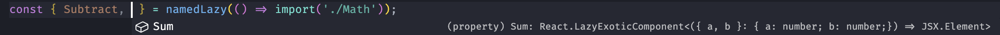
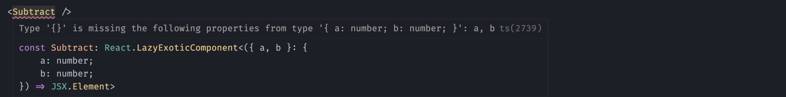

# react-named-lazy

Just like `React.lazy` but works with named exports.

## Usage

```ts
import { namedLazy } from "react-named-lazy";

// Using destructuring
const { Sum } = namedLazy(() => import("./Math"));

// Or the long way
const Subtract = namedLazy(() => import("./Math")).Subtract;
```

## TypeScript

This package provides detailed types and will only let you access exported react components.\
Other exports are ignored.

Given the following file `./Math.tsx`, `namedLazy` will infer that `Sum` and `Subtract` can be used as components,\
even though more things are exported.




```tsx
export function Sum({ a, b }: { a: number; b: number }) {
	return <div>{`${a} + ${b} = ${sum(a, b).result}`}</div>;
}

export function Subtract({ a, b }: { a: number; b: number }) {
	return <div>{`${a} - ${b} = ${subtract(a, b).result}`}</div>;
}

export const PI = Math.PI;

export function sum(a: number, b: number) {
	return { result: a + b };
}

export function subtract(a: number, b: number) {
	return { result: a - b };
}
```

> Note:\
> Some non-component functions can be compatible with `React.ComponentType` and will be shown in the list of available components.\
> E.g `export const sum(a: number, b: number) => a + b;` extends `React.ComponentType` and will thus be listed.

## Prior art

- Inspired by (read: "copied from") [react-lazily](https://github.com/JLarky/react-lazily) but with better types
